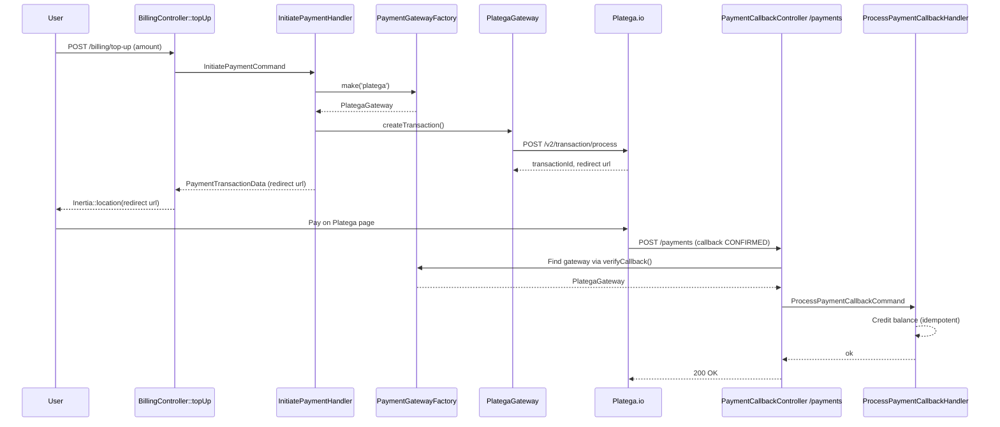

# Payment Gateway Integration Blueprint (Laravel, DDD + CQRS)

This skill provides a complete reference for integrating a payment system (using **[Platega.io](https://platega.io)** as the example) into a Laravel project using DDD and CQRS. It includes the full gateway factory pattern, DTOs, Handlers, Controllers, and Tests. Use this as a copy-paste blueprint to implement identical real-money balance top-up functionality in any Laravel project.

## Key Concept: Payment Gateway Factory

To add a new payment system, you don't need to modify controllers or callback handling. Simply implement the `PaymentGatewayInterface` and register it in the factory by name:

```php
$factory->register('platega', new PlategaGateway($credentials));
$factory->register('stripe', new StripeGateway($credentials)); // Easy to expand
```

Controllers always work through `PaymentGatewayFactory::make('platega')` or iterate through `PaymentGatewayFactory::all()`.

## Architecture



### Important Design Decisions:
- **Balance Credit**: Only occurs after a `CONFIRMED` webhook. Never optimistic.
- **Isolated Domain**: `App\Domain\Payment` is independent of third-party billing packages to ensure maintainability.
- **Single Endpoint**: A single public `POST /payments` endpoint handles **all** gateways. The controller determines which gateway sent the callback by iterating through registered gateways and calling `verifyCallback()`.
- **Idempotency**: The callback handler checks the current payment status before applying changes to prevent double-crediting.

## File Structure

```text
app/
├── Domain/
│   └── Payment/
│       ├── Contracts/
│       ├── DTOs/
│       ├── Gateways/
│       ├── Handlers/
│       ├── Commands/
│       ├── Exceptions/
│       └── PaymentGatewayFactory.php
├── Http/
│   └── Controllers/
│       ├── User/BillingController.php
│       └── Payment/Api/V1/PaymentCallbackController.php
└── Providers/
    └── PaymentServiceProvider.php
```

## 1. `PaymentGatewayInterface` Contract

Every new payment system must implement this interface.

```php
namespace App\Domain\Payment\Contracts;

use App\Domain\Payment\DTOs\CreatePaymentData;
use App\Domain\Payment\DTOs\PaymentCallbackData;
use App\Domain\Payment\DTOs\PaymentTransactionData;
use Illuminate\Http\Request;

interface PaymentGatewayInterface
{
    public function getName(): string;
    public function createTransaction(CreatePaymentData $data): PaymentTransactionData;
    public function getTransactionStatus(string $transactionId): PaymentTransactionData;
    public function verifyCallback(Request $request): bool;
    public function parseCallback(Request $request): PaymentCallbackData;
}
```

## 2. DTOs (`spatie/laravel-data`)

All DTOs are simple readonly classes.

```php
namespace App\Domain\Payment\DTOs;

use Spatie\LaravelData\Data;

class CreatePaymentData extends Data
{
    public function __construct(
        /** Amount in the main currency unit (e.g., Rubles/Dollars), not cents/kopecks. */
        public int $amount,
        public string $currency,
        public string $description,
        public string $returnUrl,
        public ?string $failedUrl = null,
        public ?string $payload = null,
    ) {}
}
```

> **Note on Units**: `CreatePaymentData->amount` is in main currency units (as expected by most APIs), while the database typically stores `amount` as integers (cents/kopecks). Explicitly document and handle this conversion at the domain boundary.

## 3. `PaymentGatewayFactory`

An in-memory registry for gateways.

```php
namespace App\Domain\Payment;

use App\Domain\Payment\Contracts\PaymentGatewayInterface;
use App\Domain\Payment\Exceptions\UnsupportedPaymentGatewayException;

class PaymentGatewayFactory
{
    private array $gateways = [];

    public function register(string $name, PaymentGatewayInterface $gateway): static
    {
        $this->gateways[$name] = $gateway;
        return $this;
    }

    public function make(string $name): PaymentGatewayInterface
    {
        return $this->gateways[$name] ?? throw new UnsupportedPaymentGatewayException($name);
    }

    public function all(): array
    {
        return $this->gateways;
    }
}
```

## 4. `PlategaGateway` Implementation

Uses Laravel's `Http` facade.

```php
namespace App\Domain\Payment\Gateways;

use App\Domain\Payment\Contracts\PaymentGatewayInterface;
// ... (imports)

class PlategaGateway implements PaymentGatewayInterface
{
    public function verifyCallback(Request $request): bool
    {
        $merchantId = (string) $request->header('X-MerchantId');
        $secret = (string) $request->header('X-Secret');

        return hash_equals($this->credentials->merchantId, $merchantId)
            && hash_equals($this->credentials->apiKey, $secret);
    }
    // ... (implementation)
}
```

### Implementation Details:
- **`verifyCallback`**: Use `hash_equals()` to prevent timing attacks.
- **Logging**: Log failures before throwing exceptions to aid in production debugging.

## 5. `PaymentServiceProvider`

```php
namespace App\Providers;

use App\Domain\Payment\PaymentGatewayFactory;
use App\Domain\Payment\Gateways\PlategaGateway;
// ... (imports)

class PaymentServiceProvider extends ServiceProvider
{
    public function register(): void
    {
        $this->app->singleton(PaymentGatewayFactory::class, function () {
            $factory = new PaymentGatewayFactory;
            $factory->register('platega', new PlategaGateway(
                // credentials from config...
            ));
            return $factory;
        });
    }
}
```

## 6. Callback Handling (Idempotency)

The `ProcessPaymentCallbackHandler` must ensure that repeated webhooks do not credit the balance multiple times.

```php
private function confirm(Payment $payment): Payment
{
    if ($payment->isCompleted()) {
        return $payment;
    }

    DB::transaction(function () use ($payment) {
        $billable = $payment->billable;
        $billable->balance += $payment->amount / 100; // kopecks to rubles
        $billable->save();

        $payment->update(['status' => 'completed', 'paid_at' => now()]);
    });

    return $payment->refresh();
}
```

## 7. Controllers

### `BillingController::topUp`
Initiates the payment and redirects the user using `Inertia::location()`.

### `PaymentCallbackController`
A generic controller that handles all incoming callbacks.

```php
public function handle(Request $request, PaymentGatewayFactory $gatewayFactory, ProcessPaymentCallbackHandler $handler): JsonResponse
{
    $gateway = collect($gatewayFactory->all())
        ->first(fn ($candidate) => $candidate->verifyCallback($request));

    if (! $gateway) {
        return response()->json(['message' => 'Unauthorized'], 401);
    }

    $handler->handle(new ProcessPaymentCallbackCommand(
        gatewayName: $gateway->getName(),
        callback: $gateway->parseCallback($request),
    ));

    return response()->json(['success' => true]);
}
```

## 8. Common Pitfalls

1. **Endpoint Versions**: API providers often change field names between versions (e.g., `url` vs `redirect`). Use defensive mapping in the gateway implementation.
2. **Currency Units**: Financial logic in the project uses integers (kopecks). Ensure clear conversion when sending data to external APIs that expect decimals.
3. **Idempotency**: Always check the current status of the payment before processing a webhook. Webhooks are often retried.
4. **Security**: Webhook endpoints must be public (no CSRF/Auth). Verify authenticity using secure headers and `hash_equals()`.

## 9. How to Port (Checklist)

1. Install `spatie/laravel-data`.
2. Copy `app/Domain/Payment` directory.
3. Create and register `PaymentServiceProvider`.
4. Configure credentials in `config/services.php` and `.env`.
5. Implement the top-up route using `InitiatePaymentHandler`.
6. Register the public `/payments` route for callbacks.
7. Write/Copy tests and adapt them to your specific `User`/`Payment` models.
8. Document endpoints via Swagger/OpenAPI.
